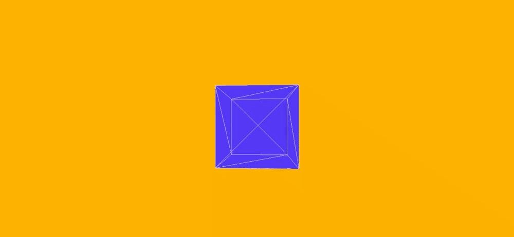
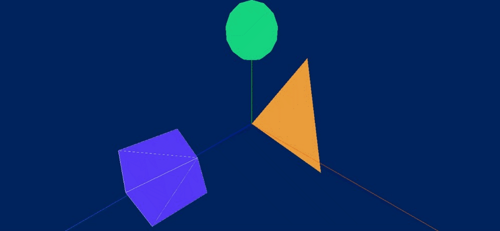

# Testes de visualização 3D Web

## Motivação

Este repositório tem como objetivo a realização de testes isolados utilizando a biblioteca open-source Three.js, com 
 exemplos praticos que poderam ser melhorados e utilizados no meu TCC que busca demonstrar como a cultura e a tecnologia podem trabalhar juntas para
promover o desenvolvimento artístico e cultural. Utilizando a computação gráfica e o desenvolvimento Web, o projeto visa resolver problemas relacionados à desvalorização da
herança cultural e mostrar como a tecnologia pode ser aplicada como uma ferramenta
para incentivar a arte e a cultura no estado.

## Computação Gráfica
Computação Gráfica é um âmbito da Ciência da Computação que se dedica ao
estudo da geração, manipulação e análise de dados visuais e geométricos.
Atualmente, está difundida em quase todas as áreas, desde o projetos
mecânicos, arquiteturais, moda, cinema e até o desenvolvimento de ferramentas
de entretenimento, como jogos eletrônicos.

Ao longo dos anos surgiram diversas ferramentas para desenvolvimento de
ambientes virtuais e conteúdo 3D para Web. Uma delas é a WebGL que possui
compatibilidade com os principais navegadores, sem haver a necessidade de
instalar algum plug-in ou extensão, considerada uma API de multiplataforma que
possibilita a criação de mídia tridimensional complexa, apesar de ser de baixo
nível, existem diversas bibliotecas desenvolvidas com o intuito de facilitar e
simplificar o desenvolvimento das aplicações 3D com uma abordagem de mais
alto nível.

## Three.js
Three.js é uma biblioteca JavaScript utilizada para criação de gráficos em 3D e visualizações interativas em navegadores web. Ela é uma das ferramentas mais populares para criação de conteúdo 3D na web e é utilizada em jogos, aplicações interativas, visualizações de dados e muitos outros tipos de projetos.

A biblioteca fornece uma série de recursos para simplificar a criação de objetos 3D, como geometrias básicas, materiais e iluminação, além de ferramentas para carregar modelos 3D mais complexos. Ela também inclui recursos para controle de câmera, detecção de colisão e interação do usuário com a cena.

A Three.js é uma biblioteca de código aberto e é mantida por uma comunidade ativa de desenvolvedores. Ela é compatível com a maioria dos navegadores modernos e é fácil de ser integrada com outras tecnologias web, como HTML, CSS e JavaScript.

## Testes

**[Igreja do Rosário](https://carlosalexandredev.github.io/3d-view-poc/teste_01/index.html)**

___

**[Cubo Girando](https://carlosalexandredev.github.io/3d-view-poc/teste_02/index.html)**

___

**[Abstração com ação Click](https://carlosalexandredev.github.io/3d-view-poc/teste_03/index.html)**

___

**[Abstração GUI Interativa](https://carlosalexandredev.github.io/3d-view-poc/teste_04/index.html)**

___

**[Câmera TackBall](https://carlosalexandredev.github.io/3d-view-poc/teste_05/index.html)**

___

**[Pedestal Cristo Redentor](https://carlosalexandredev.github.io/3d-view-poc/teste_06/index.html)**

